# Folder descriptions project developed with the company: Imagem

This is the main repository of the Fluffy project. Here are the descriptions of the main folders in this repository:

### Backlog 📅
The "Backlog" folder contains files related to the project backlog, tasks, and priorities.
<a href="./Backlog" style="color: #007bff; text-decoration: none;">Backlog</a>

### Burndown 📈
The "Burndown" folder includes burndown charts that track the project's progress over time.
<a href="./Burndown" style="color: #007bff; text-decoration: none;">Burndown</a>

### DER 📄
The "DER" folder contains the Entity-Relationship Diagram (DER) 
that describes the structure of entities and their relationships in the project database.
<a href="./DER" style="color: #007bff; text-decoration: none;">DER</a>

### Dictionary 📖
The "Dictionary" folder includes documents or files that describe terms, abbreviations, and specific concepts used in the project database.
<a href="./Dictionary" style="color: #007bff; text-decoration: none;">Dictionary</a>

### LGPD 📙
The "LGPD" folder includes documents that describe the terms and points that cover 4 LGPD topics in our project.
<a href="./LGPD" style="color: #007bff; text-decoration: none;">LGPD</a>

### Mockup 🎨
The "Mockup" folder contains mockups or visual prototypes that represent the appearance and interaction of the project's user interface.
<a href="./Mockup" style="color: #007bff; text-decoration: none;">Mockup</a>

### Team 	🎭
The "Team" folder may contain information about the project team, such as team member profiles, roles and responsibilities, or documents related to team management.
<a href="./Team" style="color: #007bff; text-decoration: none;">Team</a>

Feel free to explore each folder for more details on their respective contents.

 

 

## D.O.R

|   Front-End         |                  Back-End                   | Database  |                       AI          |
|-------------------------|------------------------------------------------|--------------------|-------------------|
| Finalized and validated prototype with the client | Prepared and validated data library  | Prepared and validated data library  | AI training according to client requirements using the mentioned neural network|
| Stories properly estimated by the development team | Stories properly estimated by the development team  | Always the latest version of the database  | Library where AI is trained |
| Libraries used in the visual part |  Time estimation established for tasks | Fields with properly constructed values in the table | Maintain good accuracy in development |
| Time estimation established for tasks | Tasks with detailed descriptions | Versioned dependencies ready in the Git repository | Refinement |
| Tasks with detailed descriptions  | Task complexity clearly defined |   | Post a sample of the AI ​​to the team |
| Task complexity clearly defined | API documented in Swagger |   | Test before even visioning |
| Test before even visioning | Test before even visioning  |  |  Versioned dependencies ready in the Git repository  |
| Versioned dependencies ready in the Git repository | Versioned dependencies ready in the Git repository   |  |  |

(<a href="#top">Scroll to top</a>)

 

 

## User Story 

| Rank           | Priority    | User Story         | Estimate | Sprint |
| ---------------| ----------------| -------------------| -----------| -------|
| 1 | High   | As a platform user, I expect to have access to an interactive map displaying the geographic distribution of customer reviews. This will enable me to identify areas with higher data density, facilitating regional analysis and the identification of specific trends in different regions. This functionality will be crucial for a more comprehensive analysis and for better understanding how reviews are geographically distributed, providing valuable insights to improve decision-making and enhance the customer experience. | 1 | 1 |
| 2 | High   | As a registered user, I want to be able to securely log in to the platform to access my information and start my data analysis. Secure authentication is essential to protect my personal information and ensure access only to authorized users. This functionality will be fundamental to guaranteeing the integrity and security of user data, providing a reliable and protected experience on the platform. | 1 | 1 |
| 3 | Medium | As a registered user on the platform, I wish to be able to easily update my personal information. Having access to a personalized profile will allow me to edit and maintain my data, ensuring the accuracy of the information stored by the platform. This functionality will be essential for me to keep my profile always updated and accurately reflecting my most recent information. | 1 | 1 |
| 4 | Medium | As a platform user, I desire the ability to filter reviews by geographical region (country, state, city) , allowing me to focus on specific areas of interest. This will streamline the analysis of relevant data for my objective, providing a clearer understanding of patterns and trends in different locations. This functionality will be essential to direct my analysis accurately and extract significant insights related to specific geographical areas. | 1 | 2 |
| 5 | Medium | As a platform user, I aim to have access to graphs and tables presenting sentiment analyses in a clear and understandable manner. This will enable me to gain an overview of the data and identify important trends, facilitating comprehension of the information and assisting in informed decision-making. This functionality will be crucial to improve data interpretation and extract relevant insights efficiently. | 1 | 2 |
| 6 | Medium | As a user, I want to filter data by sentiment category (positive, neutro , negative) and period (date, time). This will enable me to segment and analyze data based on the polarity of sentiments and when they were expressed, facilitating the understanding of sentiment fluctuations over time. | 2 | 2 |
| 7 | Medium | As a user, I want to generate detailed reports that show sentiment trends over time and across different categories, allowing me to better understand how emotions vary in specific areas of interest. These reports should provide graphs and analyses that highlight emotional changes over time, as well as enable comparisons between different sentiment categories. This will help me identify patterns, trends, and valuable insights for making informed decisions.                                                                                                                               | 2 | 3 |
| 8 | Medium | As a user, I want the ability to manually categorize reviews using custom tags. I wish to assign meaningful and relevant tags to each review, allowing for more accurate data organization based on specific analysis criteria. Additionally, I want to be able to edit tags as needed, ensuring flexibility and adaptability in the tagging process.| 2 | 3 |
| 9 | Medium |  As a user, I want access to a detailed record of all report and review sharing activities within the platform. This record should include information such as date, time, involved users, and the shared content. I want to be able to view this log easily and intuitively, allowing me to efficiently track and monitor the distribution of information within the team.                                                                                                                                     | 2 | 3 |

(<a href="#top">Scroll to top</a>)

## Mockup

 
 
Login

 
 
Dashboard Screen

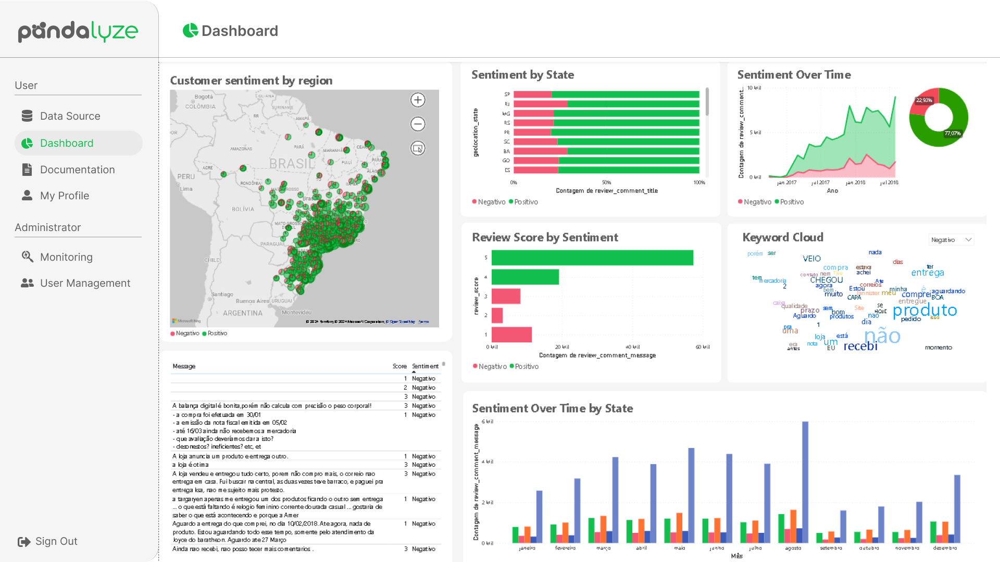

 
 
My Profile

 
 
Register

 
 
User Management

 

 
 

## LGPD

 
 
 
Topics that the LGPD covers in this academic project

  ### Below is a pdf with information about the 4 topics
 
[Click here to access the LGPD Topics for this project.](https://github.com/Fluffy-Fatec/Projeto-Integrador-Imagem/blob/develop/Documentation/LGPD/LGPD.pdf)

 

 **Tutorial for Secure Database Restoration**

This tutorial was created to provide clear guidelines on the correct method to perform a database restore, ensuring that previously deleted users are not recovered.

**Requirements:**
- Veracrypt
- Python 3.10
- PyCharm or any other IDE of your choice

**Step 1:**
**Request the Encrypted Project Image:**
Request the encrypted project image.

**Mounting the Image with Veracrypt:**
- Open Veracrypt.
- In the main window of Veracrypt, click on "Mount". The dialog window for entering the password will be displayed.
  
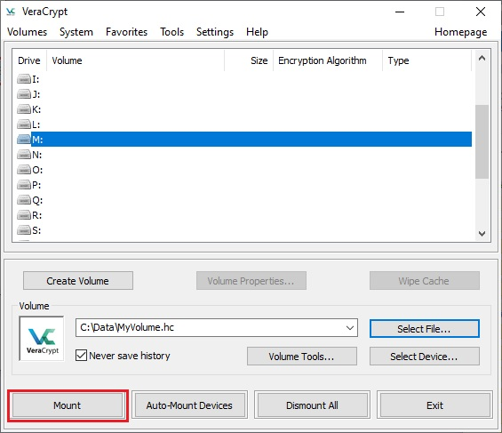

- The dialog window for entering the password will be displayed.
- Enter the provided password and click "OK".

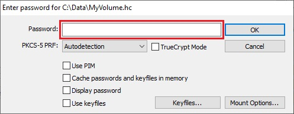

- After that, the image will be successfully mounted as a virtual drive (e.g., M:).

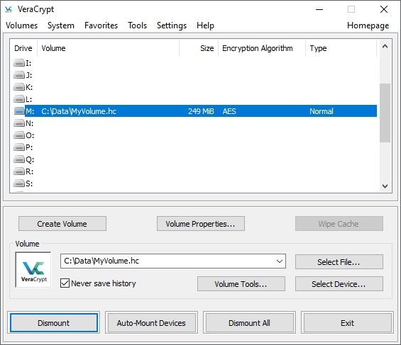
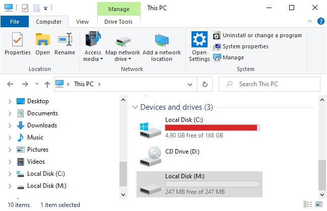

**Step 2:**
**Access the Project:**
- Open your Python IDE and navigate to the folder where the project is located on the virtual drive M:

**Run the Main Script:**
- Run the file main.py.

**Database Restoration:**
- After executing the script, the database restore will be performed, ensuring that all previously deleted records remain eliminated.

**Important Notes:**
- Ensure you have authorized access to the encrypted project image.
- When mounting the image with Veracrypt, use the correct password and select the appropriate PRF algorithm.
- The execution of the main.py script must be performed within the Python IDE in the correct project folder.
- After executing the script, verify that the database restore was successfully completed and that the previously deleted records remain eliminated.

This tutorial provides a step-by-step guide to ensure the secure restoration of the database, preventing previously deleted users from being recovered. Make sure to follow each step carefully to achieve the desired results.

 

(<a href="#top">Scroll to top</a>)

### Logical Model (James Martin's Notation)
 

 
DER Sprint 1

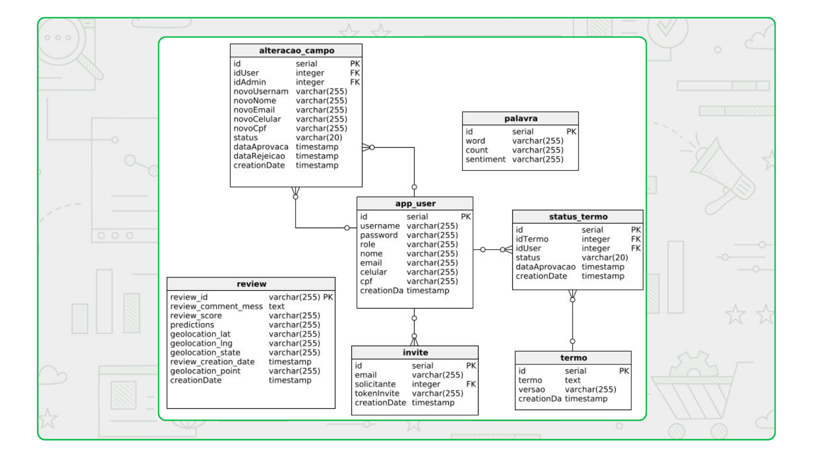
 

 

 
DER Sprint 2

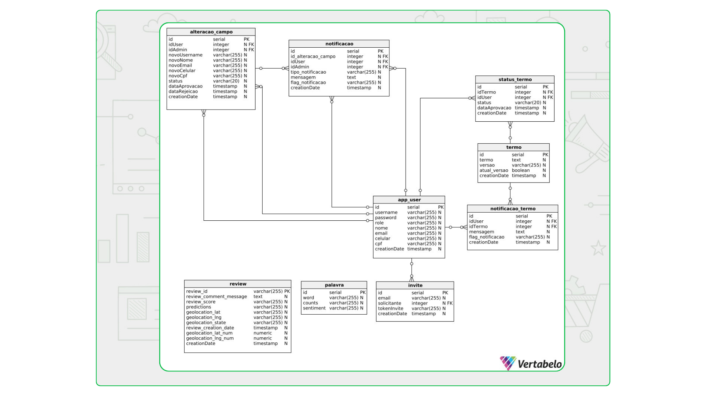

 

 
DER Sprint 3

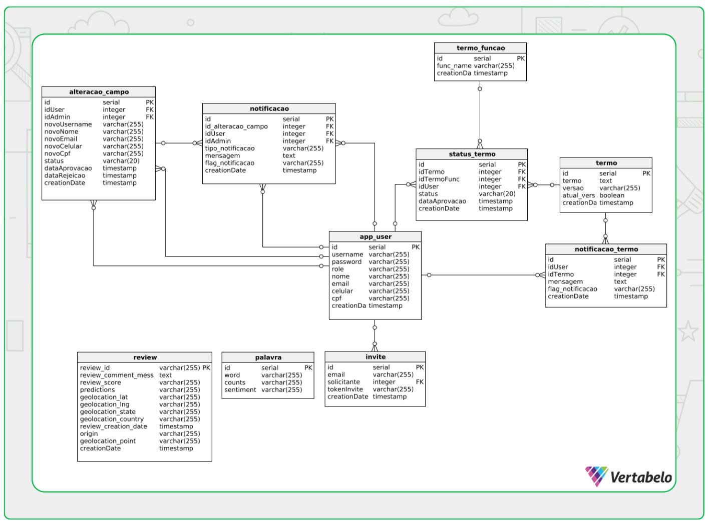

 

## Burndown
 

 
Sprint 1

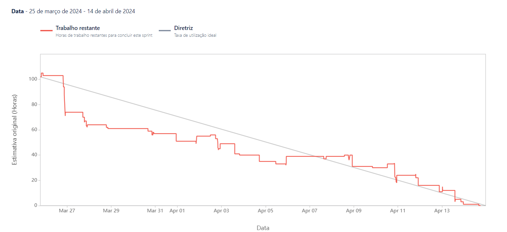

 

 
Sprint 2

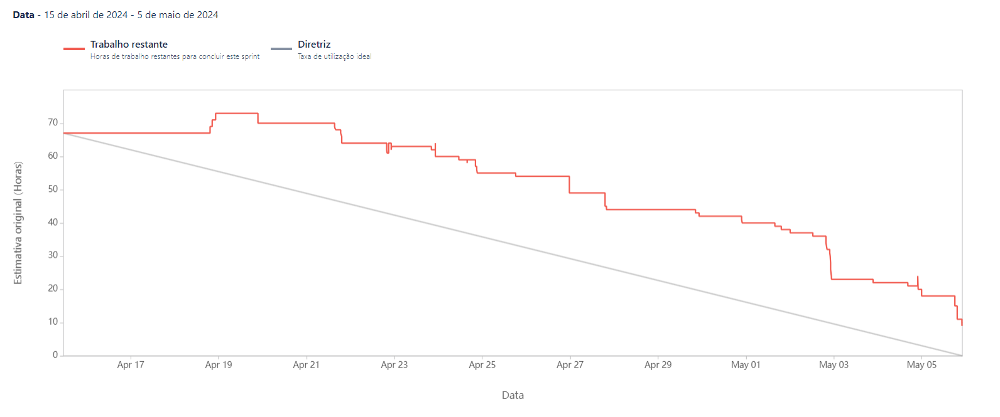

 

 
Sprint 3

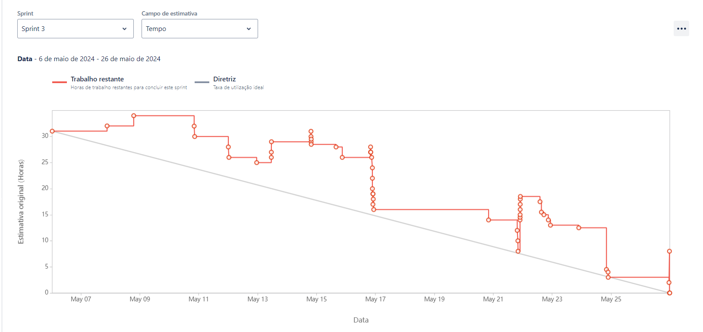

 

 
Sprint 4

(<a href="#top">Scroll to top</a>)

## Data Dictionary

 

 
Sprint 1

  
[Click here to accesses the Data Dictionary of the Database.](https://github.com/Fluffy-Fatec/Projeto-Integrador-Imagem/blob/develop/Documentacao/Dictionary/dicionario%20de%20dados.pdf)

 

 
Sprint 2

  
[Click here to accesses the Data Dictionary of the Database.](https://github.com/Fluffy-Fatec/Projeto-Integrador-Imagem/blob/main/Documentacao/Dictionary/dicionario%20de%20dados%202.pdf)

  

Sprint 3

  
[Click here to accesses the Data Dictionary of the Database.](https://github.com/Fluffy-Fatec/Projeto-Integrador-Imagem/blob/develop/Documentation/Dictionary/dicionario%20de%20dado%203.pdf)

(<a href="#top">Scroll to top</a>)

