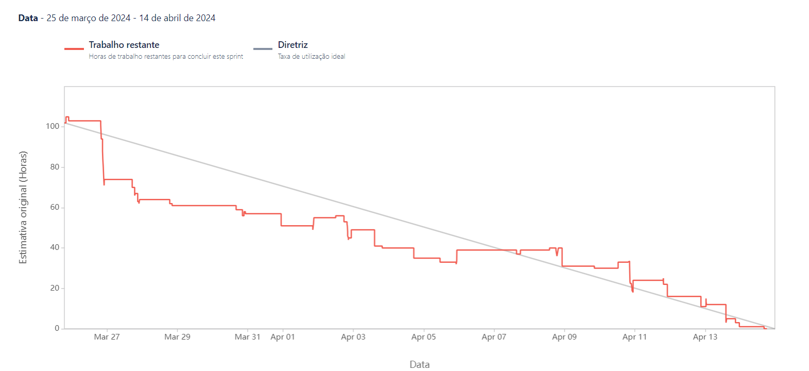

# Projeto-Integrador-Imagem

 

 
      
      
      
      
      

      <a href="#challenge">About the project</a> •
      <a href="#schedule">Schedule</a> •
      <a href="#team">Team</a> •
      <a href="#utilized-tecnologies">Utilized Tecnologies</a>

## Challenge

In this project, we aim to deeply understand customer sentiment through a sophisticated platform that analyzes online reviews. We integrate advanced technologies to map and visualize these sentiments in real geographical context, enabling companies to adjust strategies with unprecedented precision. Our goal is to provide actionable insights to drive innovation and growth, ushering in a new era of data-driven customer engagement. This challenge represents a convergence of technology, data analysis, and business strategy, designed to empower companies to anticipate customer needs and establish stronger bonds on a global scale.

(<a href="#top">Scroll to top</a>)

<li>Functional Requirements</li>
<ul>
      <li>Geolocated Sentiment Visualization</li>
      <li>Authentication and Session Management</li>
      <li>Multisource Reviews Integration</li>
      <li>Data Storage and Management</li>
      <li>Data Visualization and Reporting</li>
</ul>

<li>Non-Functional Requirements</li>
<ul>
      <li>Compliance and Security</li>
      <li>Interoperability and Integration</li>
      <li>Performance and Scalability</li>
</ul>

(<a href="#top">Scroll to top</a>)

## Solution
The Fluffy team will develop a web application with the aim of deeply understanding customer sentiment, using an advanced platform that analyzes online reviews. By integrating cutting-edge technologies, we will provide companies with actionable insights to adjust strategies with unprecedented precision, ushering in a new era of data-driven customer engagement. This convergence of technology and strategic business thinking will enable companies to anticipate customer needs and strengthen global connections.

(<a href="#top">Scroll to top</a>)

## Schedule

(<a href="#top">Scroll to top</a>)

## Sprint Backlog

## Mockup

 
 
Login

 
 
Dashboard Screen

 
 
My Profile

 
 
Register

 
 
User Management

 

(<a href="#top">Scroll to top</a>)

### Logical Model (James Martin's Notation)

## Burndown

(<a href="#top">Scroll to top</a>)

## Data Dictionary

[Click here to accesses the Data Dictionary of the Database.](https://github.com/Fluffy-Fatec/Projeto-Integrador-Imagem/blob/develop/Documentacao/Dictionary/dicionario%20de%20dados.pdf)

(<a href="#top">Scroll to top</a>)

## Team

| Avatar            							| Student         | Function           		| GitHub                                                      | LinkedIn                                              |
| -------------------------------------------- | ---------------- | ---------------- | -------------------------------------------------------------- | ----------------------------------------------------- |
| |__Emanuele Diniz__| *Product Owner*|  |  |
| |__Michael Felipe__| *Scrum Master* |  |  |
| |__Ana Clara Leal__| *Developer Team* |       |  |
| |__Aldrik Álvaro__| *Developer Team*|  |  |
| |__Luiz Felipe Borges__ | *Developer Team* |    |  |
| |__Tiago Camillo__| *Developer Team* |  |  |
| |__Victor Fernandes__  | *Developer Team*  | |  |

(<a href="#top">Scroll to top</a>)

## Utilized Tecnologies

Front-End

* [Vite+React.Js](https://vitejs.dev/guide/)
* [Mui](https://mui.com/material-ui/getting-started/installation/)
* [HTML](https://www.w3schools.com/css/)
* [CSS](https://www.w3schools.com/css/)

Back-End

* [Java](https://www.java.com/pt-BR/?msclkid=7faa842eb8f811ecab39772d4c1ae90b)
* [Spring boot](https://spring.io/projects/spring-boot) 

IA

      
* [Python](https://www.python.org/downloads/)
* [sklearn.neural_network.MLPClassifier](https://scikit-learn.org/stable/modules/generated/sklearn.neural_network.MLPClassifier.html)

Database

      
* [PostgreSQL](https://www.postgresql.org/ftp/pgadmin/pgadmin4/v8.4/windows/)

Meetings and Communication

* [Jira](https://www.atlassian.com/software/jira)

* [Confluience](https://www.atlassian.com/br/software/confluence)

* [Discord](https://discord.com/?msclkid=b4f5af84b8f811ecbd81c127a0ae68a7)

* [Whatsapp](https://www.whatsapp.com/)

* [Slack](https://slack.com/intl/pt-br/?msclkid=c00e628eb8f811ecaef374bb86d7f056)

* [Figma](https://www.figma.com/)

(<a href="#top">Scroll to top</a>)

 

 

## Contatos:

 

</a>

 
 

[&copy; 2024 Licensed under the Academic Free License version 3.0](https://opensource.org/licenses/AFL-3.0)

