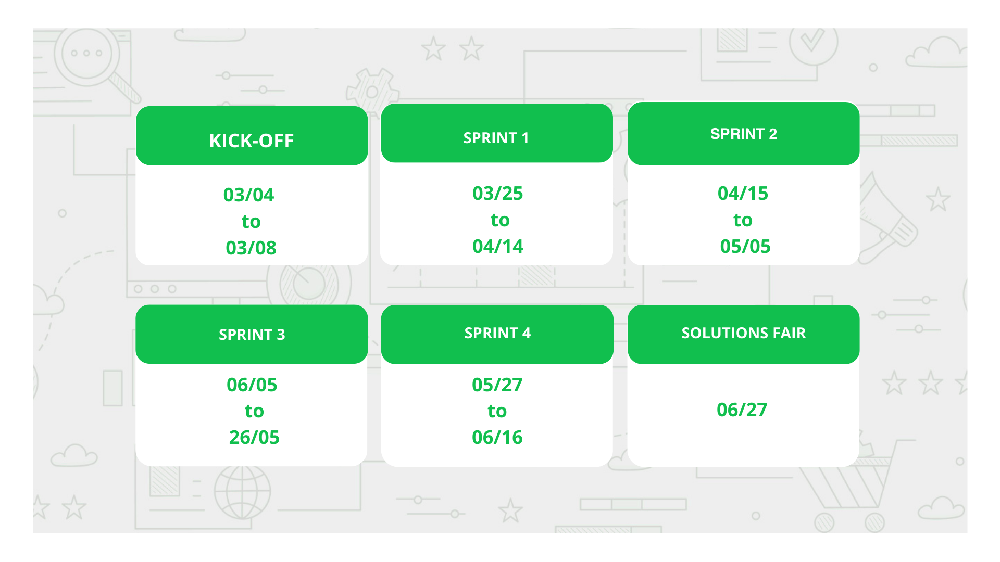
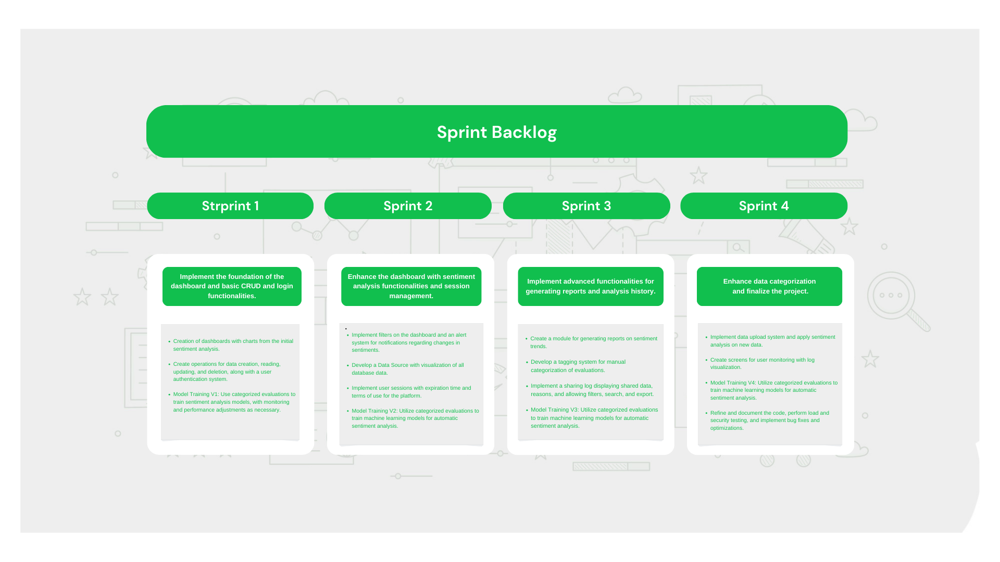
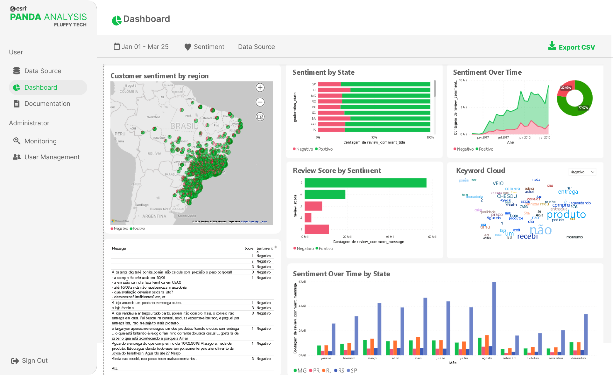
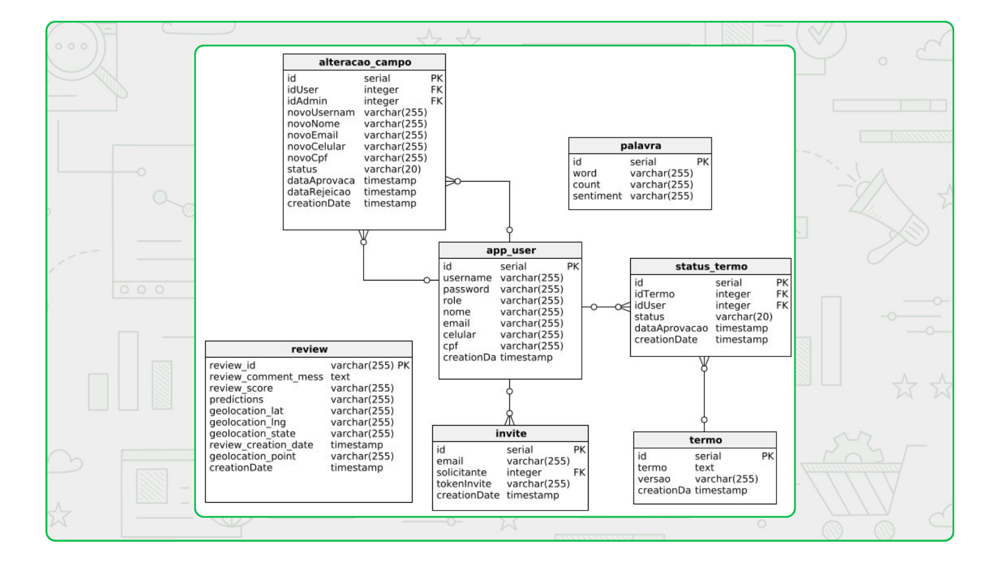

# Projeto-Integrador-Imagem

 

 
      
      
      
      
      

      <a href="#challenge">About the project</a> •
      <a href="#schedule">Schedule</a> •
      <a href="#team">Team</a> •
      <a href="#utilized-tecnologies">Utilized Tecnologies</a>

## Challenge

In this project, we aim to deeply understand customer sentiment through a sophisticated platform that analyzes online reviews. We integrate advanced technologies to map and visualize these sentiments in real geographical context, enabling companies to adjust strategies with unprecedented precision. Our goal is to provide actionable insights to drive innovation and growth, ushering in a new era of data-driven customer engagement. This challenge represents a convergence of technology, data analysis, and business strategy, designed to empower companies to anticipate customer needs and establish stronger bonds on a global scale.

(<a href="#top">Scroll to top</a>)

<li>Functional Requirements</li>
<ul>
      <li>Geolocated Sentiment Visualization</li>
      <li>Authentication and Session Management</li>
      <li>Multisource Reviews Integration</li>
      <li>Data Storage and Management</li>
      <li>Data Visualization and Reporting</li>
</ul>

<li>Non-Functional Requirements</li>
<ul>
      <li>Compliance and Security</li>
      <li>Interoperability and Integration</li>
      <li>Performance and Scalability</li>
</ul>

(<a href="#top">Scroll to top</a>)

## Solution
The Fluffy team will develop a web application with the aim of deeply understanding customer sentiment, using an advanced platform that analyzes online reviews. By integrating cutting-edge technologies, we will provide companies with actionable insights to adjust strategies with unprecedented precision, ushering in a new era of data-driven customer engagement. This convergence of technology and strategic business thinking will enable companies to anticipate customer needs and strengthen global connections.

Aiming to solve the project, the system will be delivered in four sprints:

| Sprint                  | Need      | Product         |
| ------------------------| -------------|-------------|
|Sprint 1                 | Visualization dashboard and login features | System developed with visualization functionality on feelings in different graphs and visualization functions for creating login |
|Sprint 2                 | Complete the dashboard with sentiment analysis functionalities and session management. | System developed with sentiment analysis features and filters on the dashboardand various dynamic graphs  |
|Sprint 3                 | visualization of advanced functionalities for generating reports and analysis history  | System that generates graph reports and can monitor and access logs  |
|Sprint 4                 | complete data categorization and finalize the project | System will be finalized and data categorization will be refined towards the end of the project |

(<a href="#top">Scroll to top</a>)

## Schedule

(<a href="#top">Scroll to top</a>)

## Product Backlog

| Rank           | Priority    | User Story         | Estimate | Sprint |
| ---------------| ----------------| -------------------| -----------| -------|
| 1 | High   | As a platform user, I expect to have access to an interactive map displaying the geographic distribution of customer reviews. This will enable me to identify areas with higher data density, facilitating regional analysis and the identification of specific trends in different regions. This functionality will be crucial for a more comprehensive analysis and for better understanding how reviews are geographically distributed, providing valuable insights to improve decision-making and enhance the customer experience. |  | 1 |
| 2 | High   | As a registered user, I want to be able to securely log in to the platform to access my information and start my data analysis. Secure authentication is essential to protect my personal information and ensure access only to authorized users. This functionality will be fundamental to guaranteeing the integrity and security of user data, providing a reliable and protected experience on the platform. |  | 1 |
| 3 | Medium | As a registered user on the platform, I wish to be able to easily update my personal information. Having access to a personalized profile will allow me to edit and maintain my data, ensuring the accuracy of the information stored by the platform. This functionality will be essential for me to keep my profile always updated and accurately reflecting my most recent information. |  | 1 |
| 4 | Medium | As a platform user, I desire the ability to filter reviews by geographical region, allowing me to focus on specific areas of interest. This will streamline the analysis of relevant data for my objective, providing a clearer understanding of patterns and trends in different locations. This functionality will be essential to direct my analysis accurately and extract significant insights related to specific geographical areas. |  | 2 |
| 5 | Medium | As a platform user, I aim to have access to graphs and tables presenting sentiment analyses in a clear and understandable manner. This will enable me to gain an overview of the data and identify important trends, facilitating comprehension of the information and assisting in informed decision-making. This functionality will be crucial to improve data interpretation and extract relevant insights efficiently. |  | 2 |
| 6 | High | As a platform user, I wish to have the ability to generate customized reports in popular formats such as PDF and Excel, containing sentiment analyses and data trends. This will allow me to easily share analysis results with colleagues and stakeholders. This functionality will be essential to facilitate communication and collaboration, enabling users to share valuable insights clearly and accessibly. |  | 3 |
| 7 | Medium | As a platform user, I want the capability to compare different periods and categories of sentiments in the generated reports. This will enable me to identify significant insights and better understand changes over time, facilitating informed decision-making. This functionality will be essential to analyze trends and patterns in the data, providing a more comprehensive view of sentiment category performance and evolution over time. |  | 3 |
| 8 |High | As a platform user, I expect to have access to performance metrics of the machine learning models used in sentiment analysis. This will allow me to assess the accuracy and reliability of analysis results, providing valuable insights to better understand the performance of the employed algorithms. This transparency will increase my confidence in the results and help me make informed decisions based on the analyses conducted. |  | 4 |
| 9 | Medium | As an administrator of the platform, I desire the ability to create and edit customized tags for categorizing reviews. This will enable me to personalize the categorization system according to the specific needs of the company or industry, ensuring more accurate and relevant sentiment analysis. This functionality will be crucial to adapt the classification system to business peculiarities, improving analysis quality and providing more useful insights to platform users. |  | 4 |
| 10 | Medium | As a platform user, I wish to have the ability to manually categorize reviews to improve the accuracy of sentiment analysis models. This will allow me to provide valuable feedback on review classification and contribute to the continuous improvement of sentiment analysis algorithms. This functionality will be essential to refine models and provide more accurate and relevant results to platform users. |  | 4 |

(<a href="#top">Scroll to top</a>)

## Sprint Backlog

## Mockup

### Login

### Dashboard Screen

### My Profile

### Register

### User Management

 

(<a href="#top">Scroll to top</a>)

### Logical Model (James Martin's Notation)

## Burndown

(<a href="#top">Scroll to top</a>)

## Data Dictionary

[Click here to accesses the Data Dictionary of the Database.]()

(<a href="#top">Scroll to top</a>)

## Team

| Avatar            							| Student         | Function           		| GitHub                                                      | LinkedIn                                              |
| -------------------------------------------- | ---------------- | ---------------- | -------------------------------------------------------------- | ----------------------------------------------------- |
| |__Emanuele Diniz__| *Product Owner*|  |  |
| |__Michael Felipe__| *Scrum Master* |  |  |
| |__Ana Clara Leal__| *Developer Team* |       |  |
| |__Aldrik Álvaro__| *Developer Team*|  |  |
| |__Luiz Felipe Borges__ | *Developer Team* |    |  |
| |__Tiago Camillo__| *Developer Team* |  |  |
| |__Victor Fernandes__  | *Developer Team*  | |  |

(<a href="#top">Scroll to top</a>)

## Utilized Tecnologies

Front-End

* [Vite+React.Js](https://vitejs.dev/guide/)
* [Mui](https://mui.com/material-ui/getting-started/installation/)
* [HTML](https://www.w3schools.com/css/)
* [CSS](https://www.w3schools.com/css/)

Back-End

* [Java](https://www.java.com/pt-BR/?msclkid=7faa842eb8f811ecab39772d4c1ae90b)
* [Spring boot](https://spring.io/projects/spring-boot) 

IA

      
* [Python](https://www.python.org/downloads/)
* [sklearn.neural_network.MLPClassifier](https://scikit-learn.org/stable/modules/generated/sklearn.neural_network.MLPClassifier.html)

Database

      
* [PostgreSQL](https://www.postgresql.org/ftp/pgadmin/pgadmin4/v8.4/windows/)

Meetings and Communication

* [Discord](https://discord.com/?msclkid=b4f5af84b8f811ecbd81c127a0ae68a7)

* [Whatsapp](https://www.whatsapp.com/)

* [Slack](https://slack.com/intl/pt-br/?msclkid=c00e628eb8f811ecaef374bb86d7f056)

* [Figma](https://www.figma.com/)

(<a href="#top">Scroll to top</a>)

 

 

## Contatos:

 

</a>
