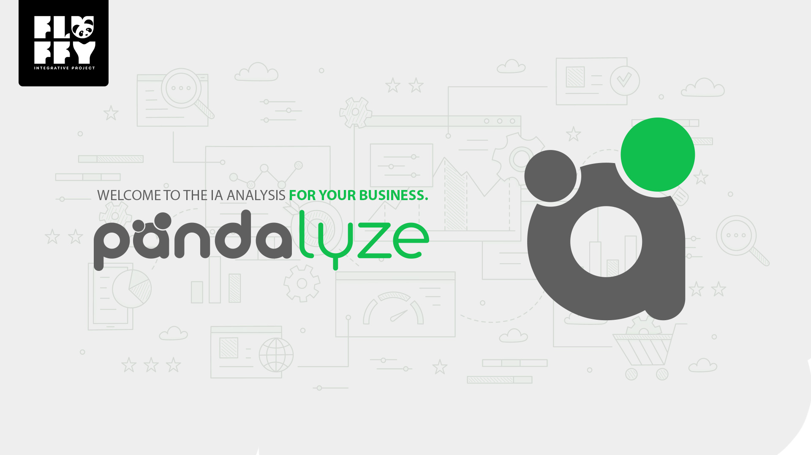
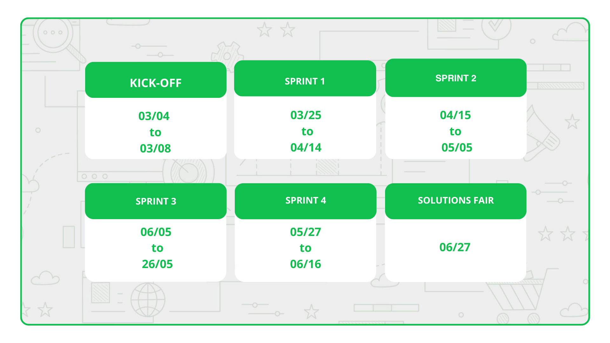
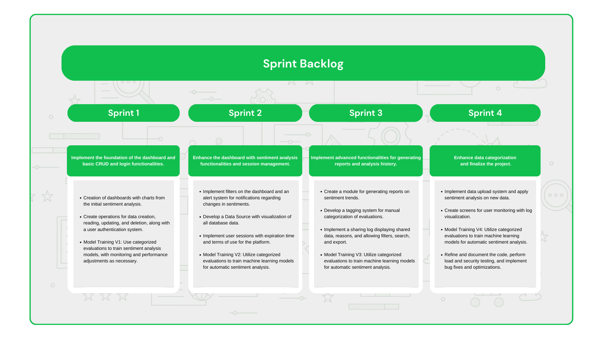

# Projeto-Integrador-Imagem

 

 
      
      
      
      
      

      <a href="#challenge">About the project</a> •
      <a href="#schedule">Schedule</a> •
      <a href="#team">Team</a> •
      <a href="#utilized-tecnologies">Utilized Tecnologies</a>

## Challenge

In this project, we aim to deeply understand customer sentiment through a sophisticated platform that analyzes online reviews. We integrate advanced technologies to map and visualize these sentiments in real geographical context, enabling companies to adjust strategies with unprecedented precision. Our goal is to provide actionable insights to drive innovation and growth, ushering in a new era of data-driven customer engagement. This challenge represents a convergence of technology, data analysis, and business strategy, designed to empower companies to anticipate customer needs and establish stronger bonds on a global scale.

(<a href="#top">Scroll to top</a>)

<li>Functional Requirements</li>
<ul>
      <li>Geolocated Sentiment Visualization</li>
      <li>Authentication and Session Management</li>
      <li>Multisource Reviews Integration</li>
      <li>Data Storage and Management</li>
      <li>Data Visualization and Reporting</li>
</ul>

<li>Non-Functional Requirements</li>
<ul>
      <li>Compliance and Security</li>
      <li>Interoperability and Integration</li>
      <li>Performance and Scalability</li>
</ul>

(<a href="#top">Scroll to top</a>)

## Solution
The Fluffy team will develop a web application with the aim of deeply understanding customer sentiment, using an advanced platform that analyzes online reviews. By integrating cutting-edge technologies, we will provide companies with actionable insights to adjust strategies with unprecedented precision, ushering in a new era of data-driven customer engagement. This convergence of technology and strategic business thinking will enable companies to anticipate customer needs and strengthen global connections.

(<a href="#top">Scroll to top</a>)

## Schedule

(<a href="#top">Scroll to top</a>)

## Sprint Backlog

 

## User Story 

| Rank           | Priority    | User Story         | Estimate | Sprint |
| ---------------| ----------------| -------------------| -----------| -------|
| 1 | Medium | As a user, I want to have an overview of sentiment analysis on a single screen.   | 2 | 1 |
| 2 | High | As a user, I want to visualize charts and tables with key sentiment metrics.     | 2 | 1 |
| 3 | High | As a user, I want to explore an interactive map with the geographical distribution of data.   | 2 | 1 |
| 4 | Medium | As a user, I want to log in to the system with my email and password.  | 2 | 1 |
| 5 | Medium | As an administrator, I want to have access to a permission system for different types of users.  | 2 | 1 |
| 6 | Medium | As a developer, I want to train machine learning models for automatic sentiment analysis.  | 2 | 1 |
| 7 | Medium | As a developer, I want to monitor the performance of models and make adjustments when necessary.   | 2 | 1 |
| 8 | Medium | As a user, I want to edit my personal information, such as name, email, and phone number.  | 2 | 1 |
| 9 | Medium | As a user, I want to change my password.  | 2 | 1 |
| 10 | Medium | As a user, I want to filter data by sentiment category (positive, negative) and period (date, time). This will enable me to segment and analyze data based on the polarity of sentiments and when they were expressed, facilitating the understanding of sentiment fluctuations over time. | 2 | 2 |
| 11 | Medium | As a user, I wish to view all data from the database in a single table. This will simplify the visualization and understanding of data, providing a comprehensive overview of available records. |2| 2 |
| 12 | Medium | As a user, I wish for my login sessions to expire after a certain period to ensure system security. This will help protect my personal information and maintain system integrity by automatically ending inactive sessions.  | 2 | 2 |
| 13 | Medium | As a user, I want to receive a notification before my session expires. This proactive notification will allow me to save my work or extend my session before it expires, avoiding data loss or unwanted interruptions. | 1 | 2 |
| 14 | Medium | As a user, I wish to be able to manually log out of the system. This will provide me with control over my own sessions, allowing me to terminate the connection with the system as needed to ensure the security and privacy of my data. | 1 | 2 |
| 15 | High | As a platform user, I wish to have the ability to generate customized reports in popular formats such as PDF and Excel, containing sentiment analyses and data trends. This will allow me to easily share analysis results with colleagues and stakeholders. This functionality will be essential to facilitate communication and collaboration, enabling users to share valuable insights clearly and accessibly. | 1 | 3 |
| 16 | Medium | As a platform user, I want the capability to compare different periods and categories of sentiments in the generated reports. This will enable me to identify significant insights and better understand changes over time, facilitating informed decision-making. This functionality will be essential to analyze trends and patterns in the data, providing a more comprehensive view of sentiment category performance and evolution over time. | 1 | 3 |

<!-- | 8 |High | As a platform user, I expect to have access to performance metrics of the machine learning models used in sentiment analysis. This will allow me to assess the accuracy and reliability of analysis results, providing valuable insights to better understand the performance of the employed algorithms. This transparency will increase my confidence in the results and help me make informed decisions based on the analyses conducted. | 1 | 4 |
| 9 | Medium | As an administrator of the platform, I desire the ability to create and edit customized tags for categorizing reviews. This will enable me to personalize the categorization system according to the specific needs of the company or industry, ensuring more accurate and relevant sentiment analysis. This functionality will be crucial to adapt the classification system to business peculiarities, improving analysis quality and providing more useful insights to platform users. | 1 | 4 |
| 10 | Medium | As a platform user, I wish to have the ability to manually categorize reviews to improve the accuracy of sentiment analysis models. This will allow me to provide valuable feedback on review classification and contribute to the continuous improvement of sentiment analysis algorithms. This functionality will be essential to refine models and provide more accurate and relevant results to platform users. | 1 | 4 | -->

|  |  |   |  |  |
|  |  |   |  |  |
|  |  |   |  |  |
|  |  |   |  |  |

-->

 

## Team

| Avatar            							| Student         | Function           		| GitHub                                                      | LinkedIn                                              |
| -------------------------------------------- | ---------------- | ---------------- | -------------------------------------------------------------- | ----------------------------------------------------- |
| |__Emanuele Diniz__| *Product Owner*|  |  |
| |__Michael Felipe__| *Scrum Master* |  |  |
| |__Ana Clara Leal__| *Developer Team* |       |  |
| |__Aldrik Álvaro__| *Developer Team*|  |  |
| |__Luiz Felipe Borges__ | *Developer Team* |    |  |
| |__Tiago Camillo__| *Developer Team* |  |  |
| |__Victor Fernandes__  | *Developer Team*  | |  |

(<a href="#top">Scroll to top</a>)

## Utilized Tecnologies

Front-End

* [Vite+React.Js](https://vitejs.dev/guide/)
* [Mui](https://mui.com/material-ui/getting-started/installation/)
* [ApexCharts](https://apexcharts.com/docs/options/chart/events/#click)
  

Back-End

* [Java](https://www.java.com/pt-BR/?msclkid=7faa842eb8f811ecab39772d4c1ae90b)
* [Spring boot](https://spring.io/projects/spring-boot) 

IA

      
* [Python](https://www.python.org/downloads/)
* [sklearn.neural_network.MLPClassifier](https://scikit-learn.org/stable/modules/generated/sklearn.neural_network.MLPClassifier.html)

Database

      
* [PostgreSQL](https://www.postgresql.org/ftp/pgadmin/pgadmin4/v8.4/windows/)

* [MongoDb](https://www.mongodb.com/try/download/community)

Meetings and Communication

* [Jira](https://www.atlassian.com/software/jira)
* [Confluience](https://www.atlassian.com/br/software/confluence)
* [Discord](https://discord.com/?msclkid=b4f5af84b8f811ecbd81c127a0ae68a7)
* [Whatsapp](https://www.whatsapp.com/)

* [Slack](https://slack.com/intl/pt-br/?msclkid=c00e628eb8f811ecaef374bb86d7f056)

* [Figma](https://www.figma.com/)

(<a href="#top">Scroll to top</a>)

 

 

## Contatos:

 

</a>

 
 

[2024 Licensed under the Academic Free License version 3.0](https://opensource.org/licenses/AFL-3.0)

