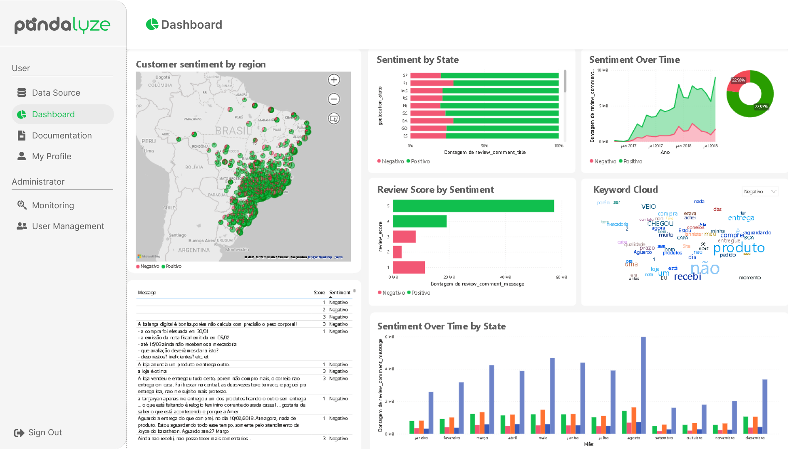

# Projeto-Integrador-Imagem

 

 
      
      
      
      
      

      <a href="#challenge">About the project</a> •
      <a href="#schedule">Schedule</a> •
      <a href="#team">Team</a> •
      <a href="#utilized-tecnologies">Utilized Tecnologies</a>

## Challenge

In this project, we aim to deeply understand customer sentiment through a sophisticated platform that analyzes online reviews. We integrate advanced technologies to map and visualize these sentiments in real geographical context, enabling companies to adjust strategies with unprecedented precision. Our goal is to provide actionable insights to drive innovation and growth, ushering in a new era of data-driven customer engagement. This challenge represents a convergence of technology, data analysis, and business strategy, designed to empower companies to anticipate customer needs and establish stronger bonds on a global scale.

(<a href="#top">Scroll to top</a>)

<li>Functional Requirements</li>
<ul>
      <li>Geolocated Sentiment Visualization</li>
      <li>Authentication and Session Management</li>
      <li>Multisource Reviews Integration</li>
      <li>Data Storage and Management</li>
      <li>Data Visualization and Reporting</li>
</ul>

<li>Non-Functional Requirements</li>
<ul>
      <li>Compliance and Security</li>
      <li>Interoperability and Integration</li>
      <li>Performance and Scalability</li>
</ul>

(<a href="#top">Scroll to top</a>)

## Solution
The Fluffy team will develop a web application with the aim of deeply understanding customer sentiment, using an advanced platform that analyzes online reviews. By integrating cutting-edge technologies, we will provide companies with actionable insights to adjust strategies with unprecedented precision, ushering in a new era of data-driven customer engagement. This convergence of technology and strategic business thinking will enable companies to anticipate customer needs and strengthen global connections.

Aiming to solve the project, the system will be delivered in four sprints:

| Sprint                  | Need      | Product         |
| ------------------------| -------------|-------------|
|Sprint 1                 | Visualization dashboard and login features | System developed with visualization functionality on feelings in different graphs and visualization functions for creating login |
|Sprint 2                 | Complete the dashboard with sentiment analysis functionalities and session management. | System developed with sentiment analysis features and filters on the dashboardand various dynamic graphs  |
|Sprint 3                 | visualization of advanced functionalities for generating reports and analysis history  | System that generates graph reports and can monitor and access logs  |
|Sprint 4                 | complete data categorization and finalize the project | System will be finalized and data categorization will be refined towards the end of the project |

(<a href="#top">Scroll to top</a>)

## Schedule

| Event                   | Date         |
| ------------------------| -------------|
|Kick-off                 |03/04 to 03/08|    
|Sprint 1                 |03/25 to 04/14|   
|Sprint 2                 |04/15 to 05/05|    
|Sprint 3                 |06/05 to 26/05|     
|Sprint 4                 |05/27 to 06/16|  
|Feira de Soluções        |06/27         |

(<a href="#top">Scroll to top</a>)

## Product Backlog

| Rank           | Priority    | User Story         | Estimate | Sprint |
| ---------------| ----------------| -------------------| -----------| -------|
| 1 | High | As a user, I want to view an interactive map with the geographic distribution of data, so that I can quickly identify areas with the highest concentration of data |  | 1 |
| 2 | Medium | As a logged in user, I want to update my data, so that I can keep my information accurate |  | 1  |
| 3 | High | As a registered user, I want to log in to the system, so that I can access my data and perform analysis |  |  1 |
| 4 | Medium | As a user, I want to filter the data by region so I can focus on specific areas of interest |  | 2 |
| 5 | Medium | As a logged in user, I want to view charts and tables with sentiment analysis so I can get an overview of the data and identify trends |  | 2 |
| 6 | Medium | As a logged in user, I want to generate PDF and Excel reports on sentiment trends so that I can share the results of my analysis with others |  | 3 |
| 7 | Medium | As a logged in user, I want to compare different periods and sentiment categories in the reports so that I can identify deeper insights from the data. |  | 3 |
| 8 | Medium | As an administrator, I want to create and edit custom tags for reviews so that I can customize the categorization system |  | 4 |
| 9 | Medium | As a logged in user, I want to manually categorize reviews so that I can improve the accuracy of sentiment analysis models |  | 4 |
| 10 |Medium | As a logged in user, I want to visualize how machine learning models perform on sentiment analysis so that I can have confidence in the analysis results. |  | 4 |

(<a href="#top">Scroll to top</a>)

## Sprint Backlog

(<a href="#top">Scroll to top</a>)

## Mockup

### Dashboard Screen

### Login

### Register

### User Management

<!-- 

<!--

<!--img src = "Documentacao/Mockup/Register.png">

<!--

<!--
(<a href="#top">Scroll to top</a>)

### Logical Model (James Martin's Notation)

## Burndown

(<a href="#top">Scroll to top</a>)

## Data Dictionary

<!--[Click here to accesses the Data Dictionary of the Database.](https://github.com/Fluffy-Fatec/Projeto-Integrador-Oracle/blob/develop/Documentacao/Dictionary/Database_Data_Dictionary_Sprint_4.pdf)

(<a href="#top">Scroll to top</a>)

<!-- DevOps Documentation

[Click here to accesses the DevOps Documentation.](https://fluffyfatec.atlassian.net/l/cp/RDTC3CTw)

(<a href="#top">Scroll to top</a>)
 -->

## Team

| Avatar            							| Student         | Function           		| GitHub                                                      | LinkedIn                                              |
| -------------------------------------------- | ---------------- | ---------------- | -------------------------------------------------------------- | ----------------------------------------------------- |
| |__Emanuele Diniz__| *Product Owner*|  |  |
| |__Michael Felipe__| *Scrum Master* |  |  |
| |__Ana Clara Leal__| *Developer Team* |       |  |
| |__Aldrik Álvaro__| *Developer Team*|  |  |
| |__Luiz Felipe Borges__ | *Developer Team* |    |  |
| |__Tiago Camillo__| *Developer Team* |  |  |
| |__Victor Fernandes__  | *Developer Team*  | |  |

(<a href="#top">Scroll to top</a>)

## Utilized Tecnologies

Front-End

* [Vite+React.Js](https://vitejs.dev/guide/)
* [Mui](https://mui.com/material-ui/getting-started/installation/)
* [HTML](https://www.w3schools.com/css/)
* [CSS](https://www.w3schools.com/css/)

Back-End

* [Java](https://www.java.com/pt-BR/?msclkid=7faa842eb8f811ecab39772d4c1ae90b)
* [Spring boot](https://spring.io/projects/spring-boot) 

IA

      
* [Python](https://www.python.org/downloads/)

Database

      
* [PostgreSQL](https://www.postgresql.org/ftp/pgadmin/pgadmin4/v8.4/windows/)
* [MongoDB](https://www.mongodb.com/try/download/community)

Meetings and Communication

* [Discord](https://discord.com/?msclkid=b4f5af84b8f811ecbd81c127a0ae68a7)

* [Whatsapp](https://www.whatsapp.com/)

* [Slack](https://slack.com/intl/pt-br/?msclkid=c00e628eb8f811ecaef374bb86d7f056)

(<a href="#top">Scroll to top</a>)

 

 

---

> GitHub [@fluffyfatec](https://github.com/fluffyfatec) &nbsp;&middot;&nbsp;
> Gmail [fluffyfatec@gmail.com](fluffyapi@gmail)
